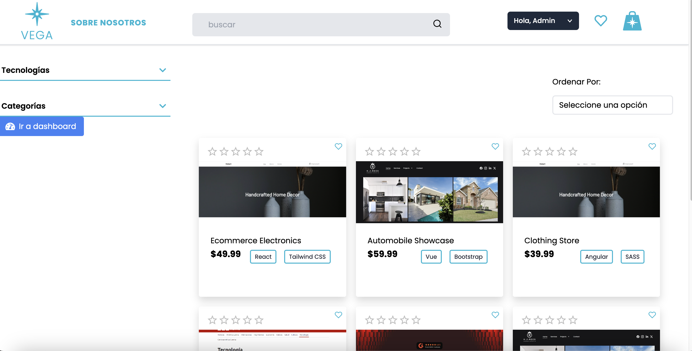
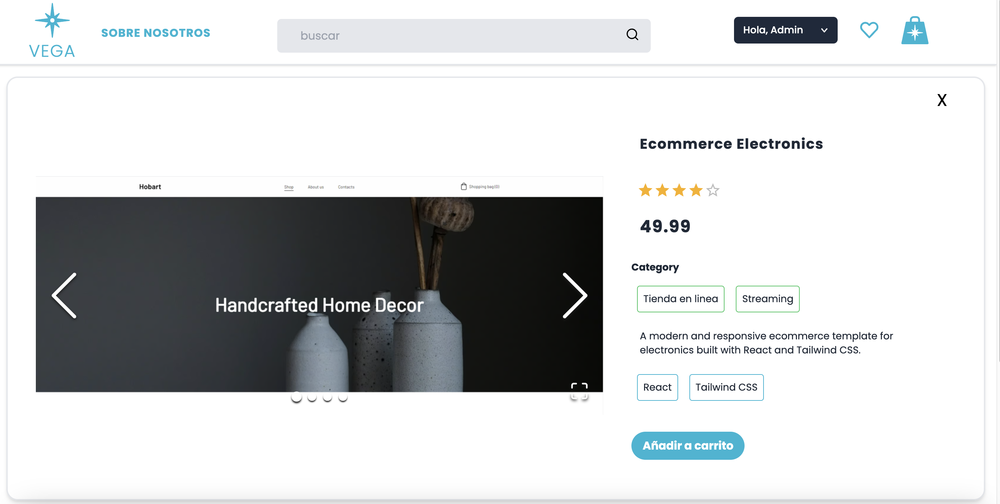
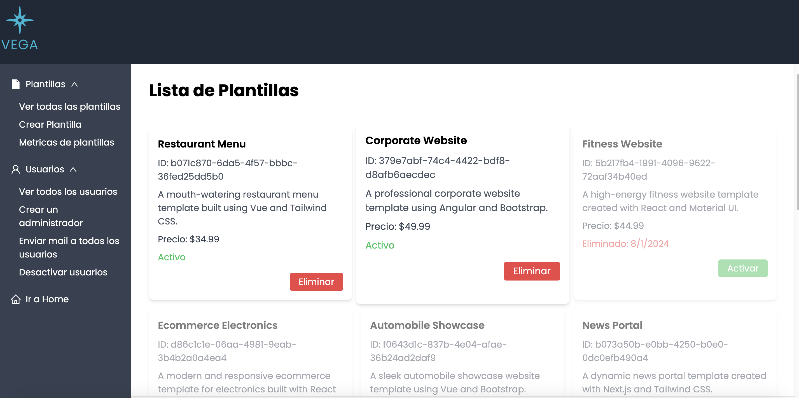

# VEGA Template Store

Welcome to **VEGA Template Store**! This application provides a comprehensive e-commerce platform for managing and purchasing templates. It offers various advanced features to enhance user experience and streamline operations.

## Features

- **Third-Party Authentication**: Users can authenticate using Google and Firebase for a secure and convenient login experience.
- **JWT Authentication**: Ensures secure access to protected routes and resources.
- **Stripe Payment Gateway**: Allows users to make payments directly through the platform, integrating with Stripe for seamless transactions.
- **Server-Based Shopping Cart**: Utilizes a server-based shopping cart to maintain cart data across sessions and devices, ensuring consistency and reducing the risk of data loss.
- **Admin and Regular Admin Permissions**: Differentiated access controls for administrators and regular users, providing customized management and functionality.
- **Soft Deletion**: Implements soft deletion for templates and users, allowing for data recovery and maintaining data integrity.
- **Password Management**: Handles passwords securely for both local and Firebase users, ensuring robust protection and proper management.

## Screenshots

Below are some screenshots of the application in action:


*Home Page*


*Detail Page*


*Admin Dashboard*

## Getting Started

To get a local copy up and running, follow these steps:

### Prerequisites

Make sure you have [Node.js](https://nodejs.org/) and [npm](https://www.npmjs.com/) installed on your machine.

### Installation

1. Clone the repository:
    ```bash
    git clone https://github.com/Benjamin-01/VEGA.git
    ```
2. Navigate to the project directory:
    ```bash
    cd your-repo
    ```
3. Install the dependencies:
    ```bash
    npm install
    ```

### Running the App

1. Start the application:
    ```bash
    npm start
    ```

2. The application will be loaded with sample data including templates, categories, and images. 

3. A default Admin user will be created with the following credentials:
    - **Email:** admin@gmail.com
    - **Password:** 12345


